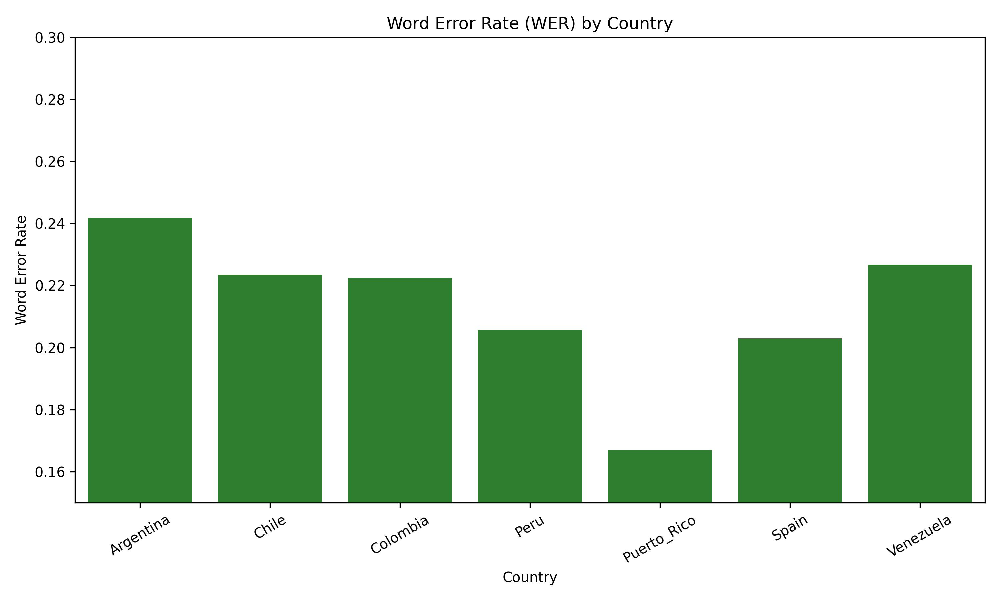
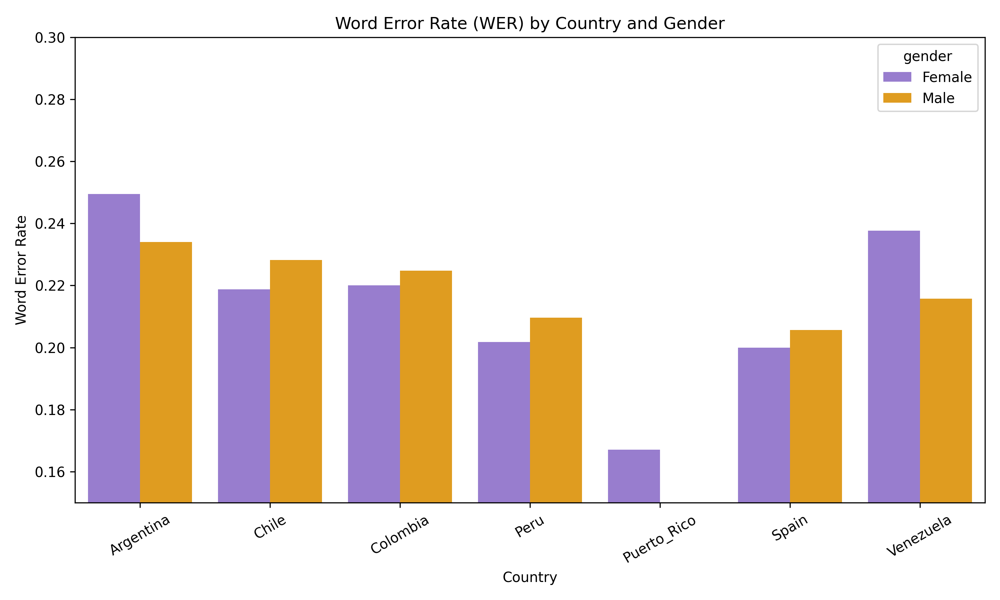

# Gender and Dialect Bias in Youtube's Spanish Captioning system

Spanish is the official language of twenty-one countries and is spoken by over 441 million people. Naturally, there are many variations in how Spanish is spoken across these countries. However, YouTube offers only one option for automatically generating captions in Spanish. This raises the question: could this captioning system be biased against certain Spanish dialects? This study examines the potential biases in YouTube's automatic captioning system by analyzing its performance across various Spanish dialects. By comparing the performance of captions for female and male speakers from different regions, we aim to identify any systematic disadvantage faced by certain groups.

My research aims to answer this question. To do so, we will use Google's [Crowdsourcing Latin American Spanish for Low-Resource Text-to-Speech](https://aclanthology.org/2020.lrec-1.801.pdf) and the [TEDx Spanish Corpus](https://www.openslr.org/67/) datasets.


## Data Download

Here you can Download the Datatsets:
[Argentina](https://www.openslr.org/61/), [Chile](https://www.openslr.org/71/), [Colombia](https://www.openslr.org/72/), [Spain](https://www.openslr.org/67/), [Peru](https://www.openslr.org/73/), [Puerto Rico](https://www.openslr.org/74/) and [Venezuela](https://www.openslr.org/75/). 
After the download you can put the data into the correspective folders. Note: There is no male audio for the Puerto Rico dataset. 

## Main 

Clone the repository 

```
git clone https://github.com/irisdaniaj/Spanish-Dialect-Bias-in-Youtube-s-Captioning-system.git
```
and create a conda environment using the requirements.txt file 

```
conda create --name myenv python=3.9
conda activate myenv
pip install -r requirements.txt
```
After downloading the data move them into the corresponding folders(all LATAM contries in the LATAM folder and extract the tedx_spain folder in the the spain folder). 
Move to the scripts directory since we will run all the scripts from here. 
```
cd scripts
```
and then execute the rename_and_move.py script
```
python rename_and_move.py
```

This script will create a nice structure of the data that will be easier to handle. 

Now, we are ready to manipulate the data. To do so, run the  concatenation_mapping.py script

```
python concatenation_mapping.py 
```
This script will concantenate all the different .wav audios files in one big audio for each contry and gender of maximum 30 minutes with a five second delay between each audio. It will also create a mapping .json file that will map the name of the audio, and its duration. We will need this later when comparing the generated caption to the ground truth text that we have. 

NOTE: Youtube requires to authenticate your account if you post videos longer than 15 minutes, so if you plan to reproduce this work you will need to. More information [here](https://support.google.com/youtube/answer/71673?hl=en&co=GENIE.Platform%3DDesktop&oco=0). 

We now need to convert the .wav files into an audio because Youtube only accept videos and not audios, so we will just use a black image and upload the audio. To do this run 

```
python audio_to_video.py 
```

In the next part we will upload the videos via the Youtube's API and we will need to get a Youtube API key. More information [here](https://blog.hubspot.com/website/how-to-get-youtube-api-key). Please after step 7 make sure to dowlonad the "client_secret.json" file and place it in the same directory where you will run the script(scripts in this repo). 

Before uploading the first video, you will be prompted to choose a YouTube channel to upload the video to. Please select the same account that you have authorized in the previous steps.

I recommend creating a new YouTube channel specifically for uploading these videos because at the end of the process, we will download all the videos associated with the selected channel ID. This will help keep your uploads organized and separate from your main account. You can find more information on how to create a new YouTube channel [here](https://support.google.com/youtube/answer/1646861?hl=en)

Now we can upload the video on Youtube by running. 

```
python upload_youtube.py
```


NOTE: Youtube only allows to upload 6 videos each days via API, so to keep track of which videos have been uploaded to Youtube the script will also create an "uploaded_videos.json" file in which the title of the uploaded videos will be saved. So, next time we run the script we will first check which videos have already been uploaded to Youtube to not uploaded them twice. 

Now that the videos have been uploaded we can retrieve the generated captions. To do so we will need the ID of the Youtube channel in which we uploaded the videos. More information [here](https://support.google.com/youtube/answer/3250431?hl=en). 

```
python captions.py -YOUR_CHANNEL_ID
```
This will download the captions of all the video uploaded in the channel and it integrates the captions with existing metadata that maps the captions to specific files and speakers and then it saves the processed and integrated captions in JSON format "concatenated_audio_{country}_{gender}.json" in the results/intermediate/captions_integrated" folder. 

If you want to replicate the final results please run 

```
python analysis.py 
```

and

```
python analysis_spain.py 
```

This script will generate .csv file that contains the filename, generated captions, treu transcription and the word error rate in the the results/final/summary folder along with some summary statistics. 

## Results 


To evaluate the accuracy of the generated captions in comparison to the annotated ground truth data, I employed the Word-Error-Rate (WER) metric. A lower WER indicates better accuracy in recognizing speech. For instance, a WER of 20\% implies that the transcription is 80\% accurate.



The above bar plot in illustrates the WER obtained for each country included in the study. Youtube's ASR achieved the best performance for speakers from Puerto Rico with a WER of 16\%, indicating that 84\% of the generated captions accurately matched the ground truth annotations, suggesting that the ASR system has a relatively high level of accuracy when transcribing the Puerto Rican dialect, which is part of the Caribbean dialect. Following Puerto Rican dialect, Youtube's ASR exhibited strong performance on both Castillian and Peruan dialects, each with a WER of 20\%. For Chilean and Colombian speakers, the generated captions were accurate in 78\% of cases, corresponding to a WER of 22\%. The worst performance was observed for Argentinian speakers, who experienced a WER of 24\%, meaning that only 76\% of the captions matched the reference transcriptions. 

It's important to highlight the considerable difference in performance between the best (Puerto Rico, 16\% WER) and worst (Argentina, 24\% WER) results, with an 8\% gap in WER, which is quite significant. This performance gap indicates that while the Youtube's ASR system may be generally effective, there are clear disparities in how well it handles different Spanish dialects. Understanding the root causes of these disparities could be a critical area for future research, as it may point to specific phonetic or lexical features that the ASR system struggles with.




As shown in bar plot above, it's important to highlight that no data was available for male Puerto Rican speakers, which limits our ability to draw conclusions about gender-based performance for this dialect. However, in the cases of Chile, Colombia, Peru, and Spain, male speakers exhibited higher Word Error Rates compared to female speakers within the same dialects. This suggests that YouTube's ASR system may be slightly more attuned to the speech patterns of female speakers in these countries, although the difference between male and female WER is relatively small. 

In contrast, in Venezuela and Argentina, male speakers achieved a lower WER, indicating better performance in the generated captions compared to their female counterparts. The performance gap between genders in these countries is more pronounced than in the other regions, suggesting that regional differences in gender-influenced speech characteristics might not be effectively captured by the ASR system.


## Conclusion 

In conclusion, this study has provided valuable insights into the performance of YouTube's ASR system across different Spanish dialects, with a particular focus on gender-based differences. While the system demonstrated relatively strong performance for Puerto Rican female speakers, the results also highlighted significant disparities, such as the higher WER for Argentinian speakers and the unexpected lack of improved accuracy for genders with more available training data. These findings underscore the need for further research to better understand the linguistic and technical factors that influence Youtube's ASR performance. Future studies should aim to broaden the scope of analysis to include a wider range of dialects and demographics, such as different age groups and underrepresented regions like Equatorial Guinea. Additionally, exploring phoneme-level challenges and conducting cross-platform comparisons will be crucial in identifying specific areas for improvement. Overcoming the current limitations related to data utilization and API constraints will be essential for enabling more comprehensive evaluations and driving advancements in ASR technology, ultimately contributing to more inclusive and accurate speech recognition systems.

## Note 

This repository contain my final project for the Advanced Methods in Social Statistics and Social Data Science, Summer Semester 2024 class at the Ludwig-Maximilians-Universität München. 

## Acknowledgements 

I would to thank you Adrian David Castro Tenemaya for his technical support. 
